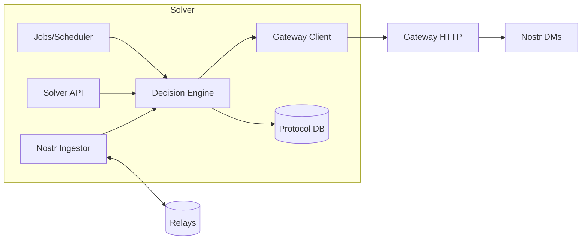

# ArkRelay Solver Guide

This guide teaches you how to build a production-grade DeFi "solver" service that integrates with the ArkRelay Gateway while keeping the gateway thin and protocol-agnostic.

- The gateway only manages Nostr authorization (31510 → 31511/31512), VTXO/transaction finalization, and operational health.
- Your solver implements protocol logic (rates, AMM math, positions, risk, keepers) and uses the gateway for signing and settlement.

See also:
- `SOLVERINTEGRATION.md` — minimal solver↔gateway contract and sequence diagrams.
- `DEFIGUIDE.md` — how to model Aave-like lending and Uniswap-like AMM using a solver-driven architecture.
- `NOSTRGUIDE.md` — event kinds and Nostr DM/security requirements.

---

## Building a Solver

### Architecture (recommended)

- **Ingestor**
  - Subscribe to multiple Nostr relays; filter for kind 31510 tagged to the gateway `npub`.
  - Deduplicate by `(pubkey, action_id)`. Persist raw events for auditability.

- **API (optional)**
  - Expose your own HTTP/WebSocket API for dApps/tools (`/lend/*`, `/amm/*`).
  - Users interact with your API or publish 31510 directly; the solver orchestrates gateway calls.

- **Core services**
  - Quote/risk engines (rate curves, HF checks, constant product math, slippage guards, oracles/TWAP).
  - State management (markets, positions, pools, idempotency keys, replay protection).
  - Job runner and scheduler (interest accrual, liquidation watcher, TWAP updater, fee sweep).

- **Integration layer**
  - Gateway client using minimal endpoints for sessions, challenges, and settlement (and optional Lightning rails).
  - Nostr publisher for correlation notices and ops messages.

### Bootstrapping checklist

1. Obtain the gateway `npub` and relay list; configure solver relays.
2. Subscribe to `kind=31510` intents that `p`-tag the gateway `npub`.
3. Validate intents: signature, `expires_at`, schema version, `action_id` uniqueness.
4. Compute a decision (quote, HF, limits) using solver DB; reject early if unsafe.
5. If signatures are required:
   - `POST /sessions/create` with `intent_data`.
   - `POST /sessions/{session_id}/challenge` with `payload_to_sign` and human-readable context.
   - `POST /signing/ceremony/start` and poll `GET /signing/ceremony/{session_id}/status` or listen for 31512 DMs.
6. On success, request VTXO/tx finalization via `/vtxos/*` or transaction helpers.
7. Watch for 31340 (success) or 31341 (failure); update solver DB and notify clients.

### Reference block diagram



---

## Nostr Payloads (31510 / 31511 / 31512)

All interactive messages use Nostr events. Encrypted DMs must follow NIP-04/44.

### 31510 — Intent (client → gateway)

A user-approved, high-level action with a single authorization. This is the only place the user is explicitly prompted, and it must include a time bound.

- **Required fields**
  - `action_id` (string, UUID v4): idempotency key, unique per user.
  - `type` (string): namespaced verb like `lend:borrow`, `amm:swap`, `amm:add_liquidity`.
  - `params` (object): protocol-specific parameters (see examples).
  - `expires_at` (unix seconds): authorization deadline.
- **Recommended**
  - `protocol_version`, `network`, `solver_id`, `deadline`, domain-specific guards (e.g., `min_out_amount`).
- **Tags**
  - MUST include `p` tag with the gateway `npub`.
  - SHOULD include a version `v` tag and an `e` tag for correlation.

- **Solver-side validation**
  - Verify Nostr signature and freshness via `expires_at`.
  - Enforce replay protection via `(pubkey, action_id)` uniqueness.
  - Validate `type` and `params` schema; enforce bounds (amount limits, slippage, deadlines).
  - Compute a deterministic `payload_ref` digest over canonical JSON (sorted keys) for later challenge binding.

- **Examples**

Deposit (lending):
```json
{
  "action_id": "a8a2d7a3-5d6b-4a1a-9a44-4de6d070e3c1",
  "type": "lend:deposit",
  "params": { "asset_id": "gBTC", "amount": 250000 },
  "expires_at": 1735689600
}
```

Swap (AMM):
```json
{
  "action_id": "23c0e0d1-ac4d-4a6a-86b5-0f1f02a1d19e",
  "type": "amm:swap",
  "params": {
    "pool_id": "LP-gBTC-gUSD",
    "in_asset": "gBTC",
    "in_amount": 50000,
    "min_out_amount": 9800000,
    "deadline": 1735689600
  },
  "expires_at": 1735689600
}
```

### 31511 — Relay Signing Challenge (gateway → wallet, encrypted DM)

Sent when signatures are needed. The payload must be deterministic and verifiable from prior state.

- **Fields**
  - `session_id` (string): gateway session id.
  - `type` (string): `sign_tx` or `sign_payload`.
  - `payload_to_sign` (hex/bytes): canonical serialized payload for signature.
  - `payload_ref` (string): digest of the logical payload; the wallet recomputes and verifies.
  - `algo` (string): signature algorithm (e.g., `BIP340`).
  - `domain` (string): signing domain like `arkrelay/amm/v1`.
  - `context` (object): UX hints — human readable summary, amounts, recipients, step index/total.
  - `expires_at` (unix seconds): optional per-challenge expiry.

- **Guidelines**
  - Keep `payload_to_sign` deterministic and minimal.
  - Include critical fields in `context.human` (asset ids, pool id, amounts) for user clarity.
  - Use separate challenges for multi-step ceremonies with explicit `step_index`/`step_total`.

Challenge example (swap):
```json
{
  "session_id": "sess_01HX...",
  "type": "sign_payload",
  "payload_to_sign": "0xdeadbeef...",
  "payload_ref": "sha256:8c1f...",
  "algo": "BIP340",
  "domain": "arkrelay/amm/v1",
  "context": {
    "human": "Authorize swap of 0.0005 gBTC in pool LP-gBTC-gUSD with min out 0.098 gUSD",
    "step_index": 1,
    "step_total": 1
  },
  "expires_at": 1735689600
}
```

### 31512 — Client Signing Response (wallet → gateway, encrypted DM)

The wallet returns the signature required to proceed.

- **Fields**
  - `session_id` (string)
  - `type` (string): mirrors 31511
  - `signature` (hex)
  - `payload_ref` (string): must match challenge
  - Optional: `pubkey`, `algo`

- **Verification (gateway/solver)**
  - Validate signature with the user pubkey and algorithm.
  - Recompute `payload_ref` and verify it matches.
  - Enforce expiry and one-time-use per challenge.
  - Persist `(action_id, session_id, payload_ref)` for auditability.

---

## End-to-End (concise)

See `SOLVERINTEGRATION.md` for detailed sequence diagrams and minimal gateway HTTP endpoints.

- **Borrow**
  - Client publishes 31510; solver checks HF/rates; solver requests challenge via sessions API.
  - Wallet returns 31512; gateway finalizes; emits 31340; solver updates positions.

- **Swap**
  - Client publishes 31510; solver quotes and checks slippage; solver requests challenge.
  - Wallet returns 31512; gateway finalizes reserves movement; emits 31340; solver commits pool state.

---

## Testing & Ops

- **Idempotency**: enforce `(pubkey, action_id)` uniqueness.
- **Safety**: enforce `expires_at`, slippage, limits; reject stale or unsafe intents.
- **Observability**: emit solver metrics (utilization, HF histogram, slippage distribution, pool reserves/volume).
- **Chaos**: simulate failures (missing DM, wrong signature, relay partial failures) and verify retries/backoffs.

---

## Minimal Solver Pseudocode (Python)

```python
import requests

GATEWAY = "https://gateway.example.com"

# 1) Create session
r = requests.post(f"{GATEWAY}/sessions/create", json={
  "user_pubkey": user_npub,
  "session_type": "protocol_op",
  "intent_data": intent_payload
})
session_id = r.json()["session_id"]

# 2) Ask for a signing challenge
requests.post(f"{GATEWAY}/sessions/{session_id}/challenge", json={
  "challenge_data": {"payload_to_sign": hex_payload},
  "context": {"human": "Authorize solver operation"}
})

# 3) Start ceremony and poll status
requests.post(f"{GATEWAY}/signing/ceremony/start", json={"session_id": session_id})
status = requests.get(f"{GATEWAY}/signing/ceremony/{session_id}/status").json()

# 4) On success, request finalization (e.g., create/assign/spend VTXOs)
requests.post(f"{GATEWAY}/vtxos/settlement/process")
```

For the canonical contract and diagrams, see `SOLVERINTEGRATION.md`.
