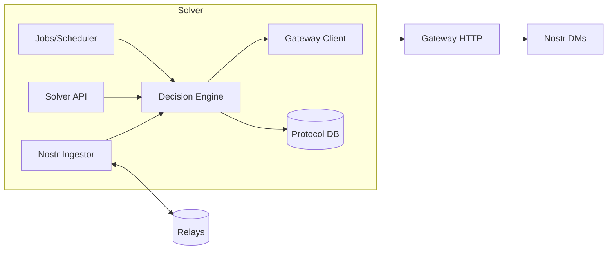
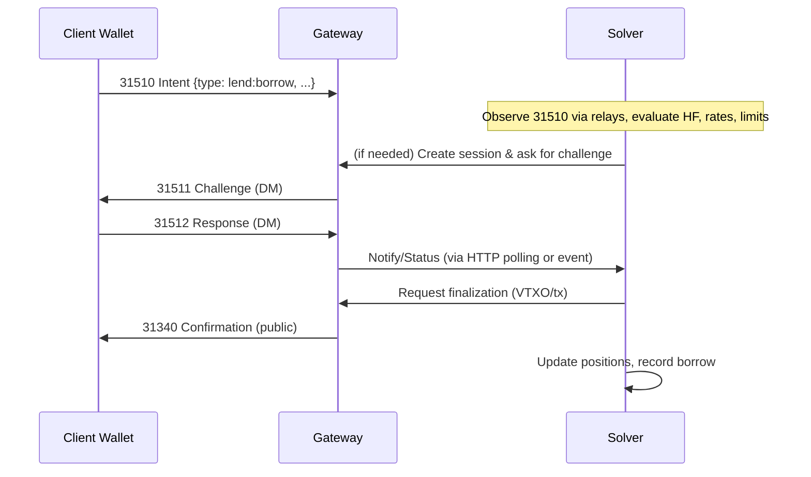
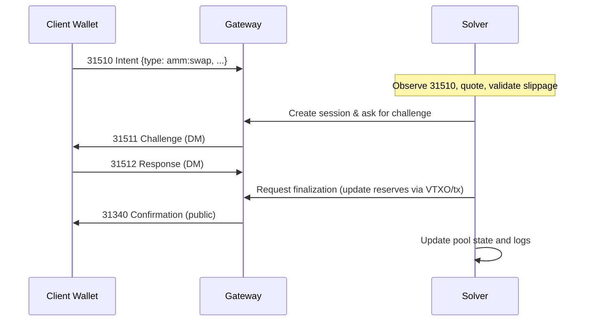

# ArkRelay Solver Integration Guide

This document defines the minimal contract between an external DeFi "solver" service and the ArkRelay Gateway. It describes the boundary, event/HTTP interfaces, recommended message shapes, and end-to-end sequences for common flows (lending borrow; AMM swap).

Gateway design principle: keep the gateway thin. The gateway manages signing sessions, challenge/response over Nostr DMs, VTXO management, transaction finalization, health, and admin. All DeFi protocol logic (quotes, risk, reserves, markets, pools, positions, keepers, and UIs) must live in your solver service, not in the gateway.

---

## 1. Responsibilities and Boundary

- Gateway (this repo)
  - Sessions and challenges: 31510 → 31511/31512 → 31340/31341
  - VTXO lifecycle and transaction finalization (incl. optional LN on/off-ramp helpers)
  - Health/metrics/admin endpoints
  - No DeFi tables or protocol endpoints

- Solver (your service)
  - Protocol APIs (e.g., `lend/*`, `amm/*`)
  - Market math and risk checks (rates, HF, AMM, slippage)
  - Datastore for protocol state (markets, positions, pools)
  - Keepers and schedulers (interest accrual, liquidations, TWAP)
  - Orchestrate Nostr flows and call gateway helper endpoints as needed

---

## Building a Solver

### Architecture (recommended)

- Ingestor
  - Subscribe to multiple Nostr relays; filter for kind 31510 tagged to the gateway `npub`.
  - Deduplicate by `(pubkey, action_id)`; persist raw events for audit.

- API (optional)
  - Provide your own HTTP/WebSocket API for dApps and internal tools (`/lend/*`, `/amm/*`).
  - Clients interact with your API or publish 31510; the solver orchestrates calls to the gateway.

- Core services
  - Quote/risk engines (rates, HF, AMM math, slippage guards, oracles/TWAP).
  - State management (markets, positions, pools, swaps log, idempotency keys).
  - Job runner and scheduler (interest accrual, liquidation watcher, TWAP updater).

- Integration layer
  - Gateway client using minimal HTTP endpoints (sessions, challenges, settlement, LN rails).
  - Nostr publisher for operational notices and correlation events.

### Bootstrapping checklist

1) Obtain the gateway `npub` and relay list; configure solver relays.
2) Subscribe for 31510 intents that `p`-tag the gateway `npub`.
3) Validate intents: signature, `expires_at`, schema version, `action_id` uniqueness.
4) Compute decision (quote, HF, limits) against solver DB; reject early if unsafe.
5) If signatures are required:
   - POST /sessions/create with `intent_data`.
   - POST /sessions/{session_id}/challenge including `payload_to_sign` and UX context.
   - POST /signing/ceremony/start and poll GET /signing/ceremony/{session_id}/status or listen for 31512 DMs.
6) On success, request VTXO/tx finalization (/vtxos/* or transaction helpers as needed).
7) Watch for 31340 (success) or 31341 (failure); update solver DB and notify clients.

### Minimal reference implementation



## 2. Nostr Event Contract

All interactive messages are Nostr events. Encrypted DMs follow NIP-04/44.

- 31510 — Intent (client → gateway)
  - User-approved, high-level action with `action_id` and `expires_at`.
  - Tags: MUST include `p` tag of the gateway `npub`.

- 31511 — Relay Signing Challenge (gateway → wallet, encrypted DM)
  - Sent when the gateway needs a signature to proceed. Includes `session_id`, `type`, and `payload_to_sign`.

- 31512 — Client Signing Response (wallet → gateway, encrypted DM)
  - Wallet returns a signature for the previously issued challenge.

- 31340 — Final Transaction Confirmation (gateway → public)
  - Public success message that correlates back to the 31510 intent. Use tags for correlation.

- 31341 — Transaction Failure Notice (gateway → wallet, encrypted DM)
  - Failure message with code and human-readable details.

- 31342 — L1 Commitment Notice (gateway → public)
  - Optional L1 settlement notice when applicable.

### 2.1 Minimal Payloads

Intent (31510):
```json
{
  "action_id": "<uuid>",
  "type": "amm:swap|lend:borrow|...",
  "params": { "...": "..." },
  "expires_at": 1735689600
}
```

Challenge (31511, DM):
```json
{
  "session_id": "<session_id>",
  "type": "sign_tx|sign_payload",
  "payload_to_sign": "<hex-or-serialized>",
  "context": { "human": "Step 2/3: authorize spend of ..." }
}
```

Response (31512, DM):
```json
{
  "session_id": "<session_id>",
  "type": "sign_tx|sign_payload",
  "signature": "<hex>",
  "payload_ref": "<hash-or-id>"
}
```

Confirmation (31340):
```json
{
  "status": "success",
  "ref_action_id": "<original-action-id>",
  "results": { "txid": "...", "outputs": ["..."] }
}
```

Failure (31341, DM):
```json
{
  "status": "failure",
  "code": 2001,
  "message": "Insufficient VTXO balance",
  "ref_action_id": "<original-action-id>"
}
```

### 2.2 31510 Intent: Schema, Validation, and Examples

Recommended fields:

- `action_id` (string, UUID v4): idempotency key, unique per user.
- `type` (string): namespaced verb, e.g., `lend:deposit`, `lend:borrow`, `amm:add_liquidity`, `amm:swap`.
- `params` (object): protocol-specific parameters.
- `expires_at` (unix seconds): authorization deadline.
- Optional: `protocol_version`, `network`, `solver_id`, `deadline`, `min_out_amount` (for swaps), `recipient_pubkey`.

Tags:
- MUST include `p` tag for the gateway `npub`.
- SHOULD include a `v` tag (schema version), and `e` tag to correlate threads.

Validation checklist (solver side):
- Verify Nostr signature, freshness (`expires_at`), and replay via `(pubkey, action_id)` uniqueness.
- Validate `type` and `params` schema; enforce bounds (amounts, slippage, deadlines).
- Compute a deterministic `payload_ref` (digest) over canonical JSON (sorted keys) for later challenge binding.

Examples:

Deposit (lending):
```json
{
  "action_id": "a8a2d7a3-5d6b-4a1a-9a44-4de6d070e3c1",
  "type": "lend:deposit",
  "params": { "asset_id": "gBTC", "amount": 250000 },
  "expires_at": 1735689600
}
```

Swap (AMM):
```json
{
  "action_id": "23c0e0d1-ac4d-4a6a-86b5-0f1f02a1d19e",
  "type": "amm:swap",
  "params": {
    "pool_id": "LP-gBTC-gUSD",
    "in_asset": "gBTC",
    "in_amount": 50000,
    "min_out_amount": 9800000,
    "deadline": 1735689600
  },
  "expires_at": 1735689600
}
```

### 2.3 31511 Challenge: Schema, Signing Domain, and UX Context

Recommended fields:

- `session_id` (string): gateway session identifier.
- `type` (string): `sign_tx` or `sign_payload`.
- `payload_to_sign` (hex): canonical bytes to sign; bind to `payload_ref`.
- `payload_ref` (string): digest/hash of the logical payload; wallet verifies match.
- `algo` (string): signature scheme hint (e.g., `BIP340`).
- `domain` (string): signing domain, e.g., `arkrelay/<protocol>/<version>`.
- `context` (object): human-readable UX hints (step number, description, amounts, recipients).
- Optional: `step_index`, `step_total`, `expires_at`.

Guidelines:
- Keep `payload_to_sign` deterministic and minimal; wallet should be able to recompute/verify using prior 31510 params.
- Include amounts, asset ids, recipient/pool identifiers in `context.human` for clarity.
- For multi-step ceremonies, send separate challenges with explicit `step_index/step_total`.

Challenge example (swap):
```json
{
  "session_id": "sess_01HX...",
  "type": "sign_payload",
  "payload_to_sign": "0xdeadbeef...",
  "payload_ref": "sha256:8c1f...",
  "algo": "BIP340",
  "domain": "arkrelay/amm/v1",
  "context": {
    "human": "Authorize swap of 0.0005 gBTC in pool LP-gBTC-gUSD with min out 0.098 gUSD",
    "step_index": 1,
    "step_total": 1
  },
  "expires_at": 1735689600
}
```

### 2.4 31512 Response: Schema and Verification

Recommended fields:

- `session_id` (string): correlates to the challenge.
- `type` (string): mirrors 31511 type (`sign_tx`/`sign_payload`).
- `signature` (hex): signature over `payload_to_sign`.
- `payload_ref` (string): must match the challenge.
- Optional: `pubkey`, `algo`.

Verification checklist (gateway/solver):
- Verify signature with user `pubkey` and algorithm; recompute `payload_ref` matches expected payload.
- Enforce `expires_at`/time bounds and one-time-use semantics per challenge.
- Persist linkage `(action_id, session_id, payload_ref)` for auditability.

---

## 3. Minimal HTTP Contract (Gateway)

Treat these as infrastructure interfaces. Do not implement protocol logic here.

- Sessions and Signing
  - `POST /sessions/create`
  - `POST /sessions/{session_id}/challenge`
  - `POST /sessions/{session_id}/respond`
  - `POST /signing/ceremony/start`
  - `GET  /signing/ceremony/{session_id}/status`

- VTXO and Settlement
  - `POST /vtxos/batch/create`
  - `POST /vtxos/assign`
  - `POST /vtxos/mark-spent`
  - `POST /vtxos/settlement/process`
  - `GET  /vtxos/settlement/status`

- Optional Lightning rails
  - `POST /lightning/lift`, `POST /lightning/land`, `POST /lightning/pay/{payment_hash}`

Refer to `USERGUIDE.md` for request/response examples and to `openapi.yaml` for the list of routes.

---

## 4. End-to-End Sequences

### 4.1 Borrow (Aave-like)


### 4.2 Swap (Uniswap-like)


---

## 5. Best Practices

- Idempotency
  - Require unique `action_id` per intent; reject duplicates server-side in the solver.
  - Store `(pubkey, action_id)` pairs to detect replays.

- Time bounds
  - Enforce `expires_at` on intents and prune old sessions/challenges.

- Correlation
  - Include the original `action_id` in 31340/31341 events. Store `session_id` ←→ `action_id` in solver.

- Error taxonomy
  - Reuse gateway error codes (see `NOSTRGUIDE.md`). Map to solver HTTP 4xx/5xx as needed.

- Security
  - Use encrypted DMs for all challenges/responses (NIP-04/44).
  - Do not log plaintext challenge payloads or signatures.
  - Rate limit at the proxy; gateway already enforces `X-Admin-Key` for `/admin/*`.

- Observability
  - The gateway exposes health/metrics/admin; solvers should export their own protocol metrics (utilization, HF histogram, pool reserves, swap volume, etc.).

---

## 6. Minimal Solver Pseudocode

```python
# Pseudocode outline
# - Subscribe to relays for 31510 intents tagged to the gateway npub
# - For each intent:
#   1) Validate type (e.g., lend:borrow, amm:swap) and parameters
#   2) Compute quote/risk (HF, slippage) using solver DB
#   3) If acceptable, call gateway HTTP to create a session and issue a challenge
#   4) Wait for 31512 DM response (or poll /signing/ceremony/status)
#   5) On success, call gateway to finalize VTXO/tx settlement
#   6) On 31340, update solver DB state; on 31341, rollback/retry

import requests

GATEWAY = "https://gateway.example.com"

# 1) Create session
r = requests.post(f"{GATEWAY}/sessions/create", json={
  "user_pubkey": user_npub,
  "session_type": "protocol_op",
  "intent_data": intent_payload
})
session_id = r.json()["session_id"]

# 2) Ask for a signing challenge
requests.post(f"{GATEWAY}/sessions/{session_id}/challenge", json={
  "challenge_data": {"payload_to_sign": hex_payload},
  "context": {"human": "Authorize solver operation"}
})

# 3) Start ceremony and poll status
requests.post(f"{GATEWAY}/signing/ceremony/start", json={"session_id": session_id})
status = requests.get(f"{GATEWAY}/signing/ceremony/{session_id}/status").json()

# 4) On success, request finalization (e.g., create/assign/spend VTXOs)
requests.post(f"{GATEWAY}/vtxos/settlement/process")
```

Replace the above with your specific flows and data.

---

## 7. Testing Your Integration

- Local relays: use multiple Nostr relays to test reliability.
- Simulate failure paths: wrong signature, expired intents, insufficient balance, and race conditions.
- Load tests: assess throughput of signature collection and settlement steps.

---

For a high-level architecture and examples by protocol type, see `DEFIGUIDE.md`. For exact HTTP routes and payloads, see `USERGUIDE.md` and `openapi.yaml`.
